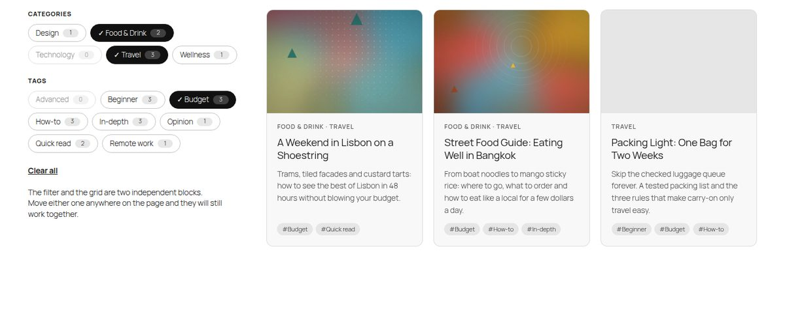
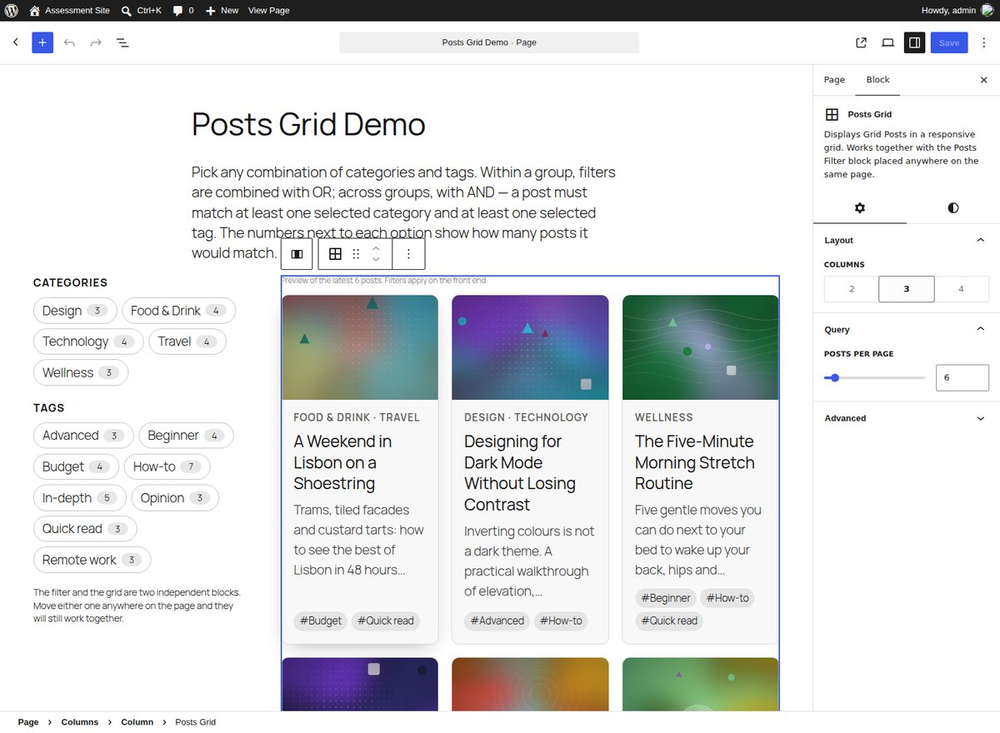

# TFPG Posts Grid & Filter

A WordPress plugin that registers two companion Gutenberg blocks and seeds everything needed to try them:

- **Posts Grid** (`tfpg/posts-grid`): a dynamic, server-rendered grid of posts (featured image, title, excerpt) with configurable columns (2, 3 or 4) and posts per page. Its pagination is an **inner block**, `tfpg/posts-pagination`.
- **Posts Filter** (`tfpg/posts-filter`): category and tag filters with multiple selection. Filters are ORed within a group and ANDed across groups, and each option shows how many posts it would match.

The two blocks are never nested. You can put them anywhere on the same page, in any number, and they stay in sync.



---

## Contents

1. [Quick start](#quick-start)
2. [What gets created on activation](#what-gets-created-on-activation)
3. [Using the blocks](#using-the-blocks)
4. [Architecture and decisions](#architecture-and-decisions)
5. [Trade-offs and known limitations](#trade-offs-and-known-limitations)
6. [Development](#development)
7. [Testing](#testing)
8. [Project structure](#project-structure)

---

## Quick start

**Requirements:** WordPress 6.8+ and PHP 7.4+. Tested on WordPress 6.8.10 and 7.1.2, with Twenty Twenty-Five (a block theme) and Twenty Twenty-One (a classic theme).

1. In wp-admin, go to **Plugins → Add New Plugin → Upload Plugin**, upload `tfpg-posts-grid-filter.zip`, and click **Activate**. You can also copy the `tfpg-posts-grid-filter` folder into `wp-content/plugins/` and activate it there.
2. A notice confirms the demo content and links to the **Posts Grid Demo** page. The plugin row on the Plugins screen also gets a **Demo page** link.
3. That's it. There's no build step and no manual content. The compiled assets ship in `build/`.

With WP-CLI:

```bash
wp plugin activate tfpg-posts-grid-filter
wp tfpg seed      # create any missing demo content (safe to repeat)
wp tfpg reset     # delete the demo content and seed it again from scratch
wp tfpg cleanup   # delete the demo content
```

## What gets created on activation

Everything uses the unique prefix **`tfpg`** (short for *Tomer's Filterable Posts Grid*):

| What | Name |
| --- | --- |
| Plugin slug / text domain | `tfpg-posts-grid-filter` |
| Post type | `tfpg_post` ("Grid Posts" in the admin menu) |
| Taxonomies | `tfpg_category` (hierarchical), `tfpg_tag` (flat) |
| Blocks | `tfpg/posts-grid`, `tfpg/posts-pagination`, `tfpg/posts-filter` |
| Store namespace, query args, options | `tfpg`, `tfpg_categories` / `tfpg_tags` / `tfpg_page`, `tfpg_demo_content` |

Demo content:

- **5 categories** (Travel, Food & Drink, Technology, Design, Wellness) and **8 tags** (Beginner, Advanced, How-to, Opinion, Quick read, In-depth, Budget, Remote work).
- **12 posts**. Each has a featured image, a hand-written excerpt, and at least one category and one tag. Most posts have two categories and two or three tags, so combinations narrow down step by step instead of dropping straight to zero. For example, *Travel* gives 4 posts, *+ Food & Drink* gives 6 (OR), and *+ Budget* gives 3 (AND).
- **12 featured images**. They're generated artwork bundled in `assets/demo-images/`, so no network access is needed. They go through the normal media pipeline, so intermediate sizes and `srcset` work.
- **A "Posts Grid Demo" page**. The filter sits in the left column and the grid (with its pagination) in the right one. They're siblings, not parent and child.

Seeding is **idempotent and self-healing**. Every seeded object carries a stable `_tfpg_demo_key` meta value, and terms are matched by slug. Re-activating the plugin never duplicates anything and recreates only what's missing (for example, a deleted demo post or page). Deactivating keeps the content. **Deleting** the plugin (`uninstall.php`) removes the demo posts, images (including their files), terms, page and options. Grid Posts that an editor created are kept.

## Using the blocks



**Posts Grid**

- *Inspector → Layout → Columns*: 2, 3 or 4. On narrow containers the grid collapses to 2 columns and then 1. It uses CSS container queries, so it reacts to the column it sits in, not to the viewport.
- *Inspector → Query → Posts per page*: 1 to 50.
- The editor shows a live React preview of the latest posts, built from the REST API through `@wordpress/core-data`. A tip appears if no Posts Filter block is on the page yet.
- Supports alignment (wide/full), colors, spacing and font size.

**Posts Grid Pagination** (inner block)

- Added automatically by the grid's template, and allowed only inside a grid (`"parent"`).
- It's hidden from the inserter, so a grid can't end up with two. If an editor removes it, an **Add pagination** button brings it back.
- Settings: show page numbers (or "Page X of Y"), and custom Previous/Next labels. Justification comes from the block's layout support.

**Posts Filter**

- Toggle the category filter and the tag filter, optionally relabel them, and show or hide post counts.
- The editor shows a warning if the page has no Posts Grid.

## Architecture and decisions

### 1. Dynamic, server-rendered blocks

All three blocks are dynamic (`render.php`). The markup is always current, crawlable, and correct on first paint. Just as important, **PHP is the only place card markup exists**. The initial render, the updates after filtering or paging, and the no-JS fallback all come from the same template. The grid saves only its inner blocks (`<InnerBlocks.Content />`), and the other two save `null`, so changing markup never triggers block validation errors.

### 2. Inter-block communication: the Interactivity API, with the URL as the source of truth

This was the main design question. The approach, in layers:

1. **The URL is the canonical state**, for example `?tfpg_categories=travel,food-drink&tfpg_tags=budget&tfpg_page=2`. `TFPG\Query` is the only code that reads it, and every block asks it for "the current query". That's why the blocks agree without knowing about each other, and why filtered views can be shared, bookmarked, and moved through with back/forward.
2. **A shared Interactivity API store (`tfpg`)** holds the client-side state (`state.filters`, `state.isLoading`). Stores with the same namespace are shared page-wide, which is the Interactivity API's built-in answer to "two independent blocks need the same state". The server seeds the store with `wp_interactivity_state()`, and derived values (`isTermSelected`, `hasActiveFilters`) are defined both as PHP closures (so directives render correctly on the server) and as JS getters.
3. **The Interactivity Router applies the change.** Toggling a filter updates `state.filters`, builds the new URL, and calls `actions.navigate()`. The router fetches that URL and swaps only the elements marked `data-wp-router-region`: every Posts Grid, and every Posts Filter (so its counts refresh). This is the same mechanism core uses for the Query Loop's "enhanced pagination".
4. **Back/forward:** the router restores the regions' HTML, and a `popstate` callback re-reads `state.filters` from the URL.

Why this approach and not the alternatives:

| Option | Why not |
| --- | --- |
| Block context / nesting | Context flows only from parent to child, and the brief requires the blocks to be independent. |
| Custom DOM events or a global JS object | It works, but reinvents state management with no server-side rendering or hydration story, and you still need a way to redraw the grid. |
| A React front end calling the REST API | Ships React to visitors, duplicates the card markup in JS and PHP, and the first paint is a spinner rather than content. |
| REST endpoint returning HTML fragments | Swapping `innerHTML` inside hydrated regions breaks the Interactivity API. You'd also need to hand-roll URL and history syncing, race handling and script loading. |
| **Interactivity API + Router (chosen)** | WordPress-native (6.5+), about 2.5 KB of plugin JS (1.2 KB gzipped), one template, SEO-friendly, shareable URLs and back/forward for free. |

There's also a small but useful detail. All three `block.json` files point `viewScriptModule` at **the same file**, `build/store/index.js` (source in `src/store/`, organized by concern: `core.js`, `filter.js`, `pagination.js`). Browsers evaluate an ES module once per URL, so it loads once whichever blocks are present. Because the whole store is in that one module, a block that only appears *after* a client-side navigation is interactive immediately. An example is the Pagination block, which reappears when filters are cleared. That holds even on WordPress versions whose router doesn't load new script modules during navigation.

### 3. Filtering logic

`TFPG\Query::build_query_args()` builds one `tax_query`:

```php
'tax_query' => array(
    'relation' => 'AND',                       // AND across filter types
    array( 'taxonomy' => 'tfpg_category', 'field' => 'slug', 'terms' => [ ... ], 'operator' => 'IN' ), // OR within
    array( 'taxonomy' => 'tfpg_tag',      'field' => 'slug', 'terms' => [ ... ], 'operator' => 'IN' ),
)
```

A group with no selection doesn't constrain the results. Slugs from the URL are sanitized, capped at 50 per group, and validated against existing terms. The args pass through the `tfpg_query_args` filter so they can be extended.

**Counts use disjunctive faceting.** A category's count respects the selected *tags* but ignores the other selected *categories*, because those are ORed. So the numbers always show what clicking would do, and they make the OR/AND rule visible. A zero-match option is dimmed but stays clickable.

### 4. Pagination as an inner block

WordPress renders inner blocks *before* their parent's render callback, so the pagination can't simply read a query that the grid runs later. Instead:

- The grid provides `tfpg/postsPerPage` through block context (`providesContext` / `usesContext`).
- Both blocks call `Query::get_grid_query()`, which is **memoized per request**, so the query runs once.
- Pagination links are real URLs that keep the active filters, and they fall back to normal navigation without JS. With JS, clicks load in place, pages prefetch on hover or focus, and focus moves to the refreshed grid for keyboard and screen reader users.
- A custom `tfpg_page` query arg is used instead of `paged`/`page`, so it never clashes with the host page's own pagination. Changing a filter resets to page 1, and an out-of-range page falls back to page 1.

### 5. Progressive enhancement and accessibility

- The filter is a real `<form method="get">` with native checkboxes inside `<fieldset>`/`<legend>`. Without JS, an **Apply filters** button appears. The form carries over unrelated query args, such as `?page_id=12` on sites without pretty permalinks.
- The chips are the native checkboxes, visually restyled but still announced and keyboard-operable. The selected state is shown with a ✓ as well as color.
- The grid has a `role="status"` live region ("3 posts found."), plus `aria-busy` while loading and `aria-current` on the current page. Motion respects `prefers-reduced-motion`.

### 6. Content model and seeding

- A **prefixed post type and taxonomies** keep the demo isolated from a site's real blog posts, and make uninstalling complete and safe.
- Seeding runs in the activation hook. `init` has already fired at that point, so the post type is registered directly first. Seeding is multisite-aware: network activation seeds each site.

### 7. Styling

Styles are theme-agnostic. Colors come from `currentColor` / `color-mix()` and theme presets (`--wp--preset--color--contrast/base`, `--wp--preset--font-size--small`), with sensible fallbacks, and inner sizes use `em` so the block's font-size setting scales everything. A few defensive rules handle classic themes: raised specificity for checkboxes, `[hidden]` enforcement, and stripping inline image styles that some themes inject into post thumbnails.

## Trade-offs and known limitations

- **One filter state per page.** Every grid on a page follows every filter on that page, which is the intended "place them anywhere" behavior. Grids also share the `tfpg_page` parameter, so two *paginated* grids on one page page together. The natural extension is a `queryId`-style attribute that namespaces the query args, as core's Query Loop does.
- **The router fetches the whole page.** Each interaction downloads the full page HTML rather than a small JSON payload. In exchange there's a single template and less JS. Prefetching on hover and HTTP/page caching (the URLs are cacheable GETs) offset the cost. On a very heavy page, a REST endpoint with client-side templates (`data-wp-each`) would be the next step.
- **Facet counts** run one ID-only query over all matching posts per filter group, cached in the object cache and invalidated on post and term changes. That's fine for hundreds or thousands of posts. At much larger scale it would need a dedicated index table.
- **The grid only queries `tfpg_post`**, which keeps the demo isolated. The `tfpg_query_args` filter can retarget it, but the taxonomy mapping lives in `Content_Model::filter_taxonomies()`.
- **Editor previews are unfiltered.** The editor shows the latest posts, and the filter preview is static. Filtering happens on the front end.
- **Hierarchical categories:** selecting a parent includes its children (the WordPress default), but counts don't roll children up into parents. The demo terms are flat.
- **Pagination uniqueness** is enforced in the UI (it's hidden from the inserter), but "Duplicate" can still create a second one inside the same grid.
- **Requires WordPress 6.8+** because of `withSyncEvent` and block registration from the metadata collection manifest.
- **Multisite:** sites created *after* network activation aren't seeded automatically. Run `wp tfpg seed --url=<site>`.
- The shared store module is printed once per block type as `<script type="module">` tags with the same URL. The browser dedupes them.
- Front-end strings are all rendered in PHP, so the view module needs no JS translations. Editor strings use `wp_set_script_translations` through block.json.

## Development

```bash
npm install          # Node 22+
npm run build        # production build to build/ (commit it: the plugin must work without a build step)
npm run start        # watch mode
npm run lint:js      # ESLint (@wordpress/eslint-plugin)
npm run lint:css     # Stylelint
composer install && npm run lint:php   # PHPCS with WordPress Coding Standards (phpcs.xml.dist)
npm run plugin-zip   # lean distributable zip (package.json "files")
```

Optional local site with Docker: `npx @wordpress/env start` uses `.wp-env.json` and serves the demo at <http://localhost:8888/posts-grid-demo/> (user `admin` / `password`).

Code quality at submission: ESLint, Stylelint and PHPCS (full `WordPress` ruleset) all pass with no errors or warnings.

## Testing

`tests/e2e/` contains Playwright end-to-end checks that run against any site with the plugin active:

| Script | What it checks |
| --- | --- |
| `frontend.js` | OR/AND results, facet counts, URL sync, back/forward restoring grid and checkboxes, empty state and Clear, pagination with filters, reset to page 1 on filter change, focus management, rapid clicks, no full page reloads, no console errors |
| `no-js.js` | Filtering through the GET form and plain pagination links with JavaScript disabled |
| `late-block.js` | A block that appears only after client-side navigation is immediately interactive |
| `editor.js` | Demo page blocks are valid, previews render, Inspector controls update attributes and serialization, pagination template, parent restriction and inserter visibility, **Add pagination** button |

```bash
npx playwright install chromium
wp tfpg reset                                  # start from known demo content
BASE=http://localhost:8080 npm run test:e2e
PAGE_ID=$(wp post list --post_type=page --name=posts-grid-demo --field=ID) npm run test:e2e:editor
```

They were also run with plain permalinks (`?page_id=`), on a classic theme, and on a page with two grids and a filter placed between them.

## Project structure

```
tfpg-posts-grid-filter.php     Plugin header, constants, bootstrap, activation hooks
uninstall.php                  Removes demo content and options
includes/
  class-plugin.php             Hooks, activation/deactivation, admin notice, action link
  class-content-model.php      tfpg_post + tfpg_category + tfpg_tag
  class-query.php              URL → filters → WP_Query (memoized), facet counts, URLs
  class-blocks.php             Block registration (manifest), shared store state/config
  class-demo-content.php       Idempotent seeding + cleanup
  class-cli-command.php        wp tfpg seed | reset | cleanup
  demo-data.php                Terms and posts definition
assets/demo-images/            Bundled featured images
src/
  posts-grid/                  block.json, edit.js (React preview + InnerBlocks), save.js, render.php, styles
  posts-pagination/            block.json, edit.js, render.php, styles
  posts-filter/                block.json, edit.js, render.php, styles
  store/                       The shared Interactivity API store (one module for all blocks)
  shared/                      Editor constants, SCSS tokens
build/                         Compiled assets (committed)
tests/e2e/                     Playwright checks
```

## License

GPL-2.0-or-later.
